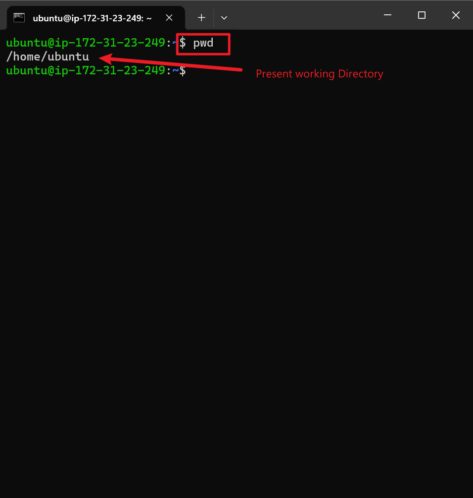

# linux_command_deep_dive: Terminal Command Explanations
This project is a hands-on guide to Linux command-line basics, designed to help users master essential terminal operations through practical examples and real-world scenarios. It focuses on foundational skills for navigating the Linux file system, managing files/directories, and understanding system configurations.

## 1. Confirming AWS terminal Connection
  
**Commands:**
```bash
pwd
ls -l
```
### Output:

pwd shows current directory: /home/ubuntu

ls -l lists directory contents (empty here).

Explanation:
Verifies the user is in their home directory and checks for files/folders.

## 2. Creating a Directory in a Restricted Location

**Commands:**
```bash
mkdir /root/example        # Fails
sudo mkdir /root/example   # Succeeds
```

### Output:

Permission denied without sudo.

Success with sudo.

Explanation:
/root is accessible only to the superuser. sudo grants temporary root privileges to execute the command.

## 3. Successfully Created using Sudo

**Commands:**
```bash
sudo mkdir /root/example   # Typo (invalid command)
```

### Output:
No explicit error shown, but the command sudo_mkdir is incorrect.

Explanation:
Typo in command: sudo_mkdir should be sudo mkdir. The correct syntax is sudo [command].

## 4. Creating Directory

**Commands:**
```bash
sudo mkdir pictures admire love          # Creates 3 folders
sudo mkdir -p pictures/admire/love      # Nested directories
ls -L                                   # Lists directories
```

### Output:
Folders admire, love, and pictures (with a nested structure) are created.

Explanation:

mkdir creates multiple directories.

-p flag creates parent directories if they don’t exist.

ls -L lists directory contents (equivalent to ls -l here).

## 5. Finding Path of current working directory
Current Directory!

**Commands:**
```bash
pwd
```

### Output:
/home/ubuntu

Explanation:
pwd (Print Working Directory) displays the current directory path.

### 6. Navigating and finding path to bin directory

**Commands:**
```bash
cd /
ls /bin
```

### Output:
Lists executables in /bin (e.g., apt, bash).

Explanation:
/bin contains essential binary executables for system operations.

## 7. Navigating and finding path to lib directory

```bash
cd /
ls /lib
```

### Output:
Lists libraries in /lib (e.g., firmware, modules).

Explanation:
/lib stores shared libraries and kernel modules.

## 8. Navigating and finding path to etc directory

**Commands:**
```bash
cd /
ls /etc
```

### Output:
Lists configuration files in /etc (e.g., apt, bash.bashrc).

Explanation:
/etc contains system-wide configuration files and scripts.

## 9. Navigating and finding path to var directory

**Commands:**
```bash
cd /
ls /var
```

### Output:
Lists directories like log, cache, tmp.

Explanation:
/var stores variable data like logs, temporary files, and databases.

## 10. Navigating and finding path to home directory
  
**Commands:**
```bash
cd /
ls /home
```
### Output:
Lists the user directory ubuntu in /home.

Explanation:
/home contains user-specific directories. Here, ubuntu is the primary user's home folder.

## 11. Navigating and finding path to usr directory

**Commands:**
```bash
cd /
ls /usr
```
### Output:
Lists subdirectories like bin, lib, include, share.

Explanation:
/usr stores user-installed software, libraries, and documentation.

## 12. Confirming the actual present working Directory after navigating

**Command:**
```bash
pwd
```
Output:
/

Explanation:
Confirms the user is in the root directory.

## 13. Listing the contents of the root directory

**Command:**
```bash
sudo ls -l /
```

### Output:
Detailed list of root directory contents, including symbolic links (e.g., bin -> usr/bin).

Explanation:

- sudo ls -l shows permissions, ownership, and links.

- Notable entries: bin, lib, and shin (typo for sbin) are symlinks to /usr directories.

## 14. changing directory.png

**Command:**
```bash
sudo cd /usr        # Fails (invalid syntax)
cd /usr             # Succeeds
```
## Output:

- sudo cd fails because cd is a shell built-in command.

- cd /usr works normally.

Explanation:

- sudo cannot execute cd directly; use sudo -i for a root shell instead.

- User navigates to /usr without sudo.

## 15. create dir photos inside /usr

```bash
sudo mkdir photos
ls -l
```
## Output:
Directory photos created in /usr.

Explanation:
sudo mkdir creates a directory with root privileges. ls -l confirms the new directory.

## 16. Creating the three directory and navigating to the three dir

```bash
sudo mkdir photos
sudo mkdir pictures admire love      # Creates 3 folders
sudo mkdir -p pictures/admire/love  # Nested directory
cd admire                          # Navigates to `admire`
cd ...                            # Typo (should be `cd ..`)
cd love                           # Navigates to `love`
cd pictures                       # Navigates to `pictures`
```
### Output:
Folders admire, love, and pictures (with nested admire/love) are created.

Explanation:

- mkdir -p creates parent directories automatically.

- Typos like cd ... (instead of cd ..) may cause errors.

## 17. Listing all files in subdirectories /bin 

```bash
ls -R /bin
```
### Output:
Recursively lists all files and subdirectories in /bin.

Explanation:

- ls -R shows directory contents recursively.

- /bin contains critical system binaries (e.g., apt, bash).

## 18. Showing all hidden files in addition to visible ones
  
**Command:**
```bash
ls -a
```

### Output:
Shows hidden files (e.g., .pwd.lock, .resolv.conf.systemd-resolved.bak) alongside regular files in /etc.

Explanation:

- ls -a lists all files, including hidden ones (prefixed with .).

- Hidden files are typically configuration files or system-related data.

## 19. show file size and easy to read format such as MB, GB, and TB


**Command:**
```bash
ls -lh
```

### Output:
Displays file sizes in human-readable format (e.g., 4.0K, 3.4K) and directory details.

Explanation:

- -h flag converts sizes to KB, MB, etc.

- Useful for quickly understanding file/directory sizes.

## 20. Listing, combining, and write file Content of os-release in /etc to a terminal

**Command:**
```bash
sudo cat /etc/os-release
```
### Output:
#### Displays Ubuntu version details:
PRETTY_NAME="Ubuntu 24.04.2 LTS"
VERSION="24.04.2 LTS (Noble Numbat)"

Explanation:

- /etc/os-release contains OS metadata.

- cat reads and prints the file contents

## 21. copied files from folder to directory

**Command:**
```bash
mkdir Documents
touch demofile.txt demofile2.txt
cp demofile.txt ~/Documents
```
### Output:
Files demofile.txt are copied to ~/Documents.

Explanation:

- cp [source] [destination] copies files.

- Use absolute paths (/home/ubuntu/Documents) for clarity.

## 22. cp from one files to another directory


## 23. cp from one file to another file

**Command:**
```bash
cp demofile1.txt demofile2.txt
```
### Output:
Overwrites demofile2.txt with the contents of demofile1.txt.

Explanation:

- cp replaces the destination file if it exists.

- Use cp -i to enable confirmation prompts.

## 24. copy an entire dir to another directory using cp -R flag

**Command:**
```bash
cp -R Documents Documents_backup
```
### Output:
Creates a recursive copy of Documents into Documents_backup.

Explanation:

- -R (recursive) copies directories and their contents.

- Essential for duplicating nested folders.

## 25. Move a file to another directory

**Command:**
```bash
mv demofile.txt ~/Documents
```
 Output:
Moves demofile.txt from the home directory to ~/Documents.

Explanation:

- mv moves files (deletes the original).

- Use mv -i for confirmation before overwriting.

## 26. Deleting a file  in a directory
  
**Command:**
```bash
rm demofile.txt
```
## Output:
demofile.txt is deleted from ~/Documents.

Explanation:

- rm permanently deletes files (no trash/recycle bin).

- Use cautiously; deleted files cannot be easily recovered.

## 27. Prompts system confirmation before deleting a file 

**Command:**
```bash
rm -i demofile1.txt
```
### Output:
Prompts: rm: remove regular file 'demofile1.txt'? y

Explanation:

- -i (interactive) asks for confirmation before deletion.

- Safe for preventing accidental file removal.

## 28. Removed without confirmation

**Command:**
```bash
rm -f demofile1.txt
```

### Output:
File demofile2.txt is deleted without prompts.

Explanation:

- -f (force) ignores nonexistent files and overrides confirmation.

- Warning: Can lead to irreversible data loss.

## 29. Removed a file recursively

**Command:**
```bash
rm -r demofile3.txt
```
### Output:
File demofile3.txt is deleted (though -r is unnecessary for single files).

Explanation:

- -r (recursive) is typically used for directories.

- Misusing -r on files works but is redundant.

## 30. Create a html file

**Command:**
```bash
touch Web.html
```
## Output:
Empty file Web.html created in ~/Documents.

Explanation:

- touch creates empty files or updates timestamps.

- Use text editors (e.g., nano, vim) to add content.

## 31. find the location of a file

**Command:**
```bash
find /home -name demofile1.txt
```
### Output:
/home/ubuntu/demofile1.txt
/home/ubuntu/Documents_backup/demofile1.txt

Explanation:

- find searches directories recursively.

- -name filters results by filename.

- Multiple paths indicate duplicate files